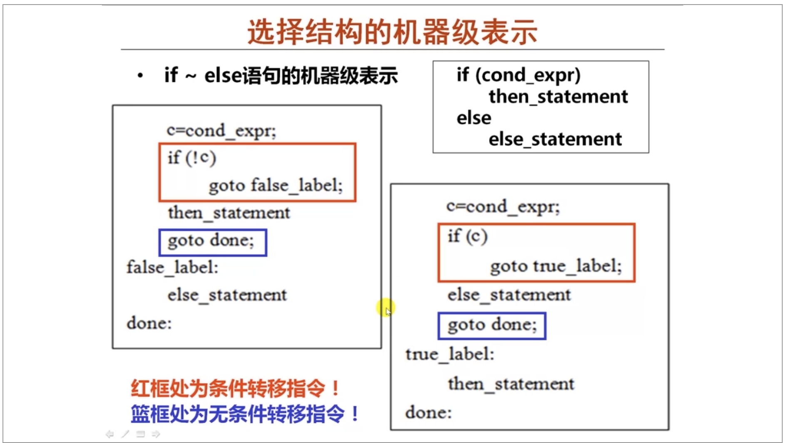
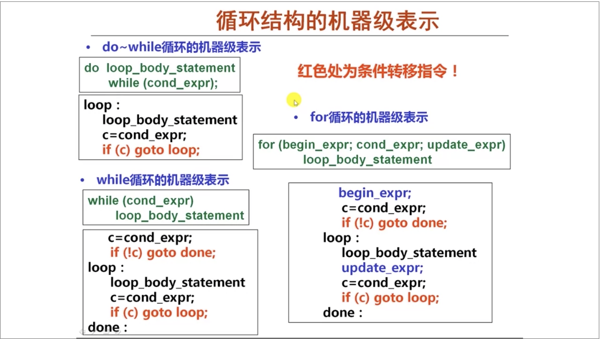

# C语言语句的机器级表示

## 1. 过程调用

- ### `IA-32`寄存器使用约定

  ### `P过程调用Q过程`下

  - #### 调用者P需保存的寄存器：`EAX, EDX, ECX`
  
    调用前保存，调用返回后恢复
  
  - #### 被调用者Q保存寄存器：`EBX, ESI, EDI`
  
    被调用时先保存，返回前恢复
  
  - #### `EBP, ESP`: 帧指针寄存器，栈指针寄存器 
  
- ### 机器级表示

  - #### P：准备参数入栈

  - #### P：`call`指令发起过程调用
  
    返回地址入栈，并跳转执行
  
  - #### Q：构造栈帧
  
    ```
    pushl %ebp
    move %esp, %ebp
    subl OP1, %esp
    ```
  
  - #### Q：过程体执行
  
    - 取出参数
  
    - 分配局部空间，并初始化
  
    - 返回值入`EAX`
  
  - #### Q：退栈
  
    `leave` 指令，相当于：
  
    ```
    movl %esp, %ebp
    popl %ebp
    ```
  
  - #### Q：返回
  
    `ret`指令，取返回地址，装入`EIP`
  
  - #### 实例
  
    ```
    int add(int, int);
    
    int main(int argc, char ** argv){
    	int t1 = 125;
    	int t2 = 80;
    	int sum = add(t1, t2);
      return sum;
    }
    
    int add(int x, int y){
      return x + y;
    }
    ```
  
    `gcc -S -m32`，未优化版，有内存冗余
  
    ```assembly
    	.section	__TEXT,__text,regular,pure_instructions
    	.build_version macos, 10, 15	sdk_version 10, 15
    	.globl	_main                   ## -- Begin function main
    	.p2align	4, 0x90
    _main:                                  ## @main
    	.cfi_startproc
    ## %bb.0:
    	pushl	%ebp
    	.cfi_def_cfa_offset 8
    	.cfi_offset %ebp, -8
    	movl	%esp, %ebp
    	.cfi_def_cfa_register %ebp
    	pushl	%esi
    	subl	$36, %esp
    	.cfi_offset %esi, -12
    	movl	12(%ebp), %eax				## 取出参数argc
    	movl	8(%ebp), %ecx					## 取出参数argv
    	movl	$0, -8(%ebp)
    	movl	$125, -12(%ebp)				## 初始化t1
    	movl	$80, -16(%ebp)				## 初始化t2
    	movl	-12(%ebp), %edx				## 准备参数
    	movl	-16(%ebp), %esi				## 准备参数
    	movl	%edx, (%esp)					## 准备参数
    	movl	%esi, 4(%esp)					## 准备参数
    	movl	%eax, -24(%ebp)         ## 4-byte Spill，保存寄存器内容
    	movl	%ecx, -28(%ebp)         ## 4-byte Spill，保存内容
    	calll	_add
    	movl	%eax, -20(%ebp)				## 取返回值
    	movl	-20(%ebp), %eax
    	addl	$36, %esp	
    	popl	%esi
    	popl	%ebp
    	retl
    	.cfi_endproc
                                            ## -- End function
    	.globl	_add                    ## -- Begin function add
    	.p2align	4, 0x90
    _add:                                   ## @add
    	.cfi_startproc
    ## %bb.0:
    	pushl	%ebp
    	.cfi_def_cfa_offset 8
    	.cfi_offset %ebp, -8
    	movl	%esp, %ebp
    	.cfi_def_cfa_register %ebp
    	subl	$8, %esp
    	movl	12(%ebp), %eax
    	movl	8(%ebp), %ecx
    	movl	8(%ebp), %edx
    	addl	12(%ebp), %edx
    	movl	%eax, -4(%ebp)          ## 4-byte Spill
    	movl	%edx, %eax
    	movl	%ecx, -8(%ebp)          ## 4-byte Spill
    	addl	$8, %esp
    	popl	%ebp
    	retl
    	.cfi_endproc
                                            ## -- End function
    
    .subsections_via_symbols
    ```
  
    `gcc -S -m32 -Os`
  
    ```assembly
    	.section	__TEXT,__text,regular,pure_instructions
    	.build_version macos, 10, 15	sdk_version 10, 15
    	.globl	_main                   ## -- Begin function main
    _main:                                  ## @main
    	.cfi_startproc
    ## %bb.0:
    	pushl	%ebp
    	.cfi_def_cfa_offset 8
    	.cfi_offset %ebp, -8
    	movl	%esp, %ebp
    	.cfi_def_cfa_register %ebp
    	movl	$205, %eax
    	popl	%ebp
    	retl
    	.cfi_endproc
                                            ## -- End function
    	.globl	_add                    ## -- Begin function add
    _add:                                   ## @add
    	.cfi_startproc
    ## %bb.0:
    	pushl	%ebp
    	.cfi_def_cfa_offset 8
    	.cfi_offset %ebp, -8
    	movl	%esp, %ebp
    	.cfi_def_cfa_register %ebp
    	movl	12(%ebp), %eax
    	addl	8(%ebp), %eax
    	popl	%ebp
    	retl
    	.cfi_endproc
                                            ## -- End function
    
    .subsections_via_symbols
    ```
## 2.选择结构



## 3.循环结构




​    

