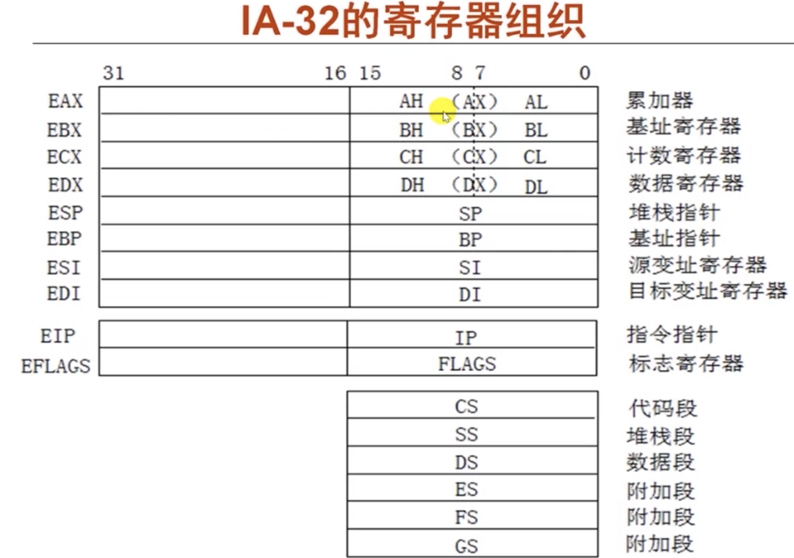

# IA-32体系结构

## 1.寄存器组织

## 2.常用指令
- ### 传送指令

  - #### 通用数据传送

    `mov: movb, movw, movl + SRC + DEST`, 操作数`DEST`和`SRC`位数一致
    `movsx: movsbw, movswl + SRC + DEST`，操作数`DEST`和`SRC`位数不一致, 符号填充
    `movzx: movzbw, movzwl + SRC + DEST`，操作数`DEST`和`SRC`位数不一致, 0填充
    
    `XCHG + DEST + SRC`, 交换数据
    
    `PUSH/POP: pushl, pushw, popl, popw + SRC/DEST`, 入栈出栈
    
  - #### 地址传送
  
    `LEA + SRC + DEST`
  
  - #### 输入输出指令
  
    `IN + M + DEST`, 从端口号(立即数M)输入到DEST
  
    `OUT + SRC + M`, 从SRC输出到端口号M
  
  - #### 标志传送指令
  
    `PUSHF，POPF`, EFLAG寄存器压、出栈

- ### 定点算术运算

  `ADD`，加

  `SUB`，减

  `INC`，加1

  `DEC`，减1

  `NEG`，取负

  `CMP`，比较

  `MUL/IMUL`，无符号乘/带符号乘

  `DIV/IDIV`，无符号除/带符号除

##3.参考资料

[1]: http://www.logix.cz/michal/doc/i386/chp02-00.htm	"I386"

