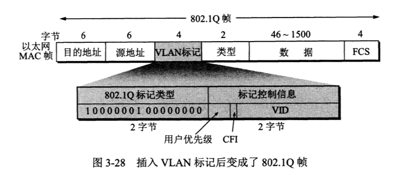

# 基本概念

- 数据链路 = 物理链路 + 协议
- 网卡（网络适配器）：是实现协议的软硬件。工作在数据链路层。
  - `in: 数字信号 out: IP数据报 ——> 计算机系统中的网络层 `

# 基本功能

- 封装成帧
  - 帧头：ASCII 控制字符SOH `0x01`
  - 帧尾：ACSII 控制字符EOT `0x04`
  
- 透明传输：帧数据部分不会因为被认为SOH或EOT而出现差错，数据相对于帧头、帧尾的选择透明
  
  - 字节填充：转义字符ESC `0x1B`
  
- 差错检测

  - 作用：检测比特差错，保证凡是接收端接受的帧均无差错。

  - 方法：帧数据尾部添加帧检验序列(FCS, Frame Check Sequence)

      - 循环冗余检验(CRC, Cyclic Redundancy Check)

    ​      CRC-16 (16位除数)，CRC-32(32位除数)
  
- 可靠传输：

  - 有线链路

  ​      不处理帧丢失、重复、失序传输差错，不保证数据链路层向上提供可靠传输

  - 无线链路

    增加帧编号、确认和重传机制，保证可靠传输

# 点对点协议
计算机和`ISP`进行通信时所使用的协议	模拟信号

  

  - 封装成帧：`0x7E`帧界定

  - 透明传输：

    - 同步传输：连续比特传送

      零比特填充：连续5个1后填0

    - 异步传输：逐个字符`8bit`传送

      字节填充：转义字符`0x7D`
    
  - 差错检测：`FCS`
  
  - 协议字段：

    - `0xc021` -------------- 链路控制协议 `(LCP, Link Control Protocol)`
       - 不上交网络层
       - 建立、检测、终止链路连接
       - 配置MTU、Authenticate

    - `0x8021` -------------- 网络控制协议`(NCP, Network Control Protocol)`

      - 不上交网络层

      - 网络层地址协商

    - `0x0021` -------------- IP数据报
      - 上交网络层

- 有连接

# 广播协议

局域网使用的协议

- 以太网：符合IEEE 802.3标准的局域网, 传输曼彻斯特编码的数字信号
  
  - 无连接
  
  - 载波监听多点接入/冲突检测 协议`(CSMA/CD, Carrier Sense Multiple Acess With Collision Detection)`
  
    - 半双工
  
    - 设`1bit` 单程时间`t`, 则发送时间间隔`+(-)t`的信号会发生冲突
  
      解决办法：争用期`2t`内，边发送变检测
  
      以太网争用期：`512 bit` ==>  帧最小64字节
  
    - 帧最小发送间隔 `96 bit`：使接收方缓存来得及清理
  
- 集线器: 扩展以太网的覆盖范围

  - 工作在物理层
  - 信号整形、加强，故障检测
  - 使用集线器的星型以太网本质仍是总线型

  - MAC帧

    
    - 帧间隔、曼彻斯特编码使得MAC帧不需要帧结束定界符
    - 类型：`0x0800` IP数据报

- 交换机：工作在数据链路层

  - 存储转发
  - 自学习地址表
  - 无冲突，无`CSMA/CD`
  - 全双工
  - 仍然采用以太网帧结构

 - 虚拟局域网

   - 局域网给用户提供的一种服务，不是一种新型局域网

   - 使用扩展的以太网帧格式

     