# 服务

- 向上只提供简单灵活的、无连接的、尽最大努力交付的数据报服务

- 不提供服务质量的承诺

网络层设备比较简单，网络造假降低
# 协议

## 网际协议IP

是一个把各个局域网连接起来的一个协议，由此引出IP地址（屏蔽局域网数据链路层实现的异质性）、

路由选择、路由存储转发。

### IP地址

- 定义：给互联网上的每一台主机的每一个接口分配一个在全世界范围内是唯一的32位的标识符

- 由ICANN（`Internet Corporation for Assigned Names and Numbers` ）分配

- 分类的IP地址：

  IP地址 = 网络号(net-id) + 主机号(host-id)

  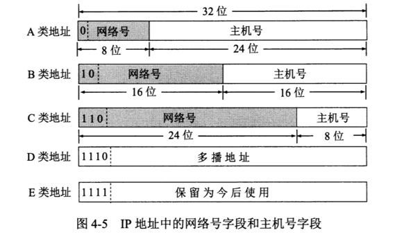

	- 主机号：
	
	  全0: 本网络， 如10.0.0.0
	
	  全1: 本网络广播
### IP数据报

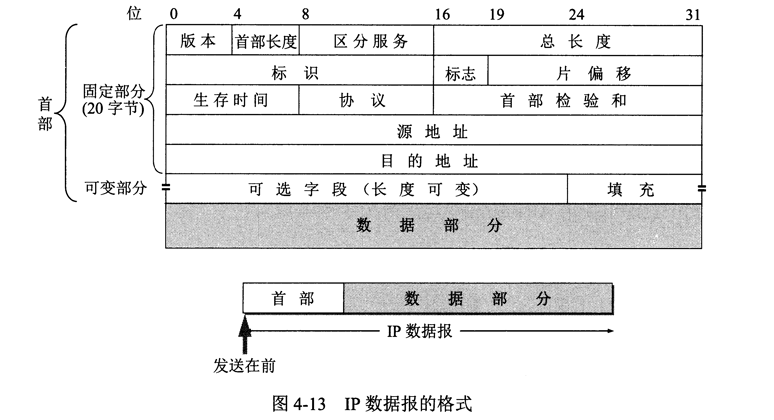

- 版本：

- 首部长度：x 4字节，最小0101

- 区分服务

- 总长度：首部 + 数据。

  标准：长度小于576个字节的数据报保证可以被链路层处理

- 标识：

  在网络层，分片后标识相同的数据报片属于同一个数据报

- 标志：MF位 + DF位 + 不用位 

- 片偏移：x 8字节，每个数据报的长度一定是8字节的整数倍

- TTL

- 协议

  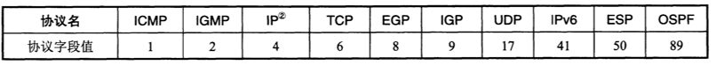

- 首部检验和：由于TTL, 标志，片偏移字段的可能改变，每个路由器都需要重新计算首部检验和
### IP分组转发

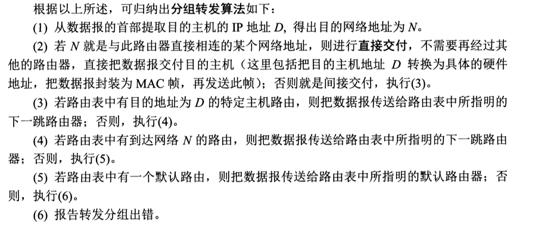

### 划分子网

- 单一局域网划分子网，对广域网透明，只有局域网内使用子网掩码路由选择。

- 子网掩码

### 构造超网-无分类编址CIDR(`Classless Inter-Domain Routing`)

- 有划分子网发展而来。
- 无A，B，C类地址概念，取而代之的是地址块。
- 网络前缀相同的网络地址构成地址块。
- 地址块是路由选择的单位。
- 地址块路由采取最长前缀匹配规则。

## ARP协议（`Address Resolution Protocol`）

- IP地址------>MAC地址

- 主机设有ARP高速缓存(缓存出错如缓存中的主机更换了网卡，会导致数据报文丢失)
  

  
  
  

  
## ICMP协议（Internet Control Message Protocol）

  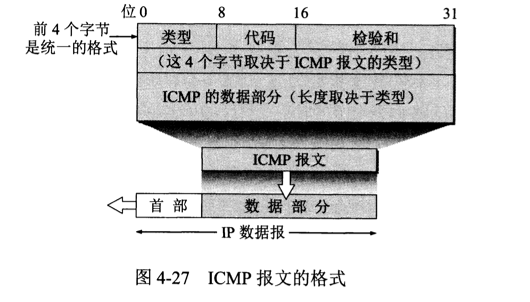

- 差错报告：

  数据部分 = 原报文IP首部 + 原报文数据部分前8 个字节（用于得到运输层报文信息）

  - 终点不可达：`0x03`

    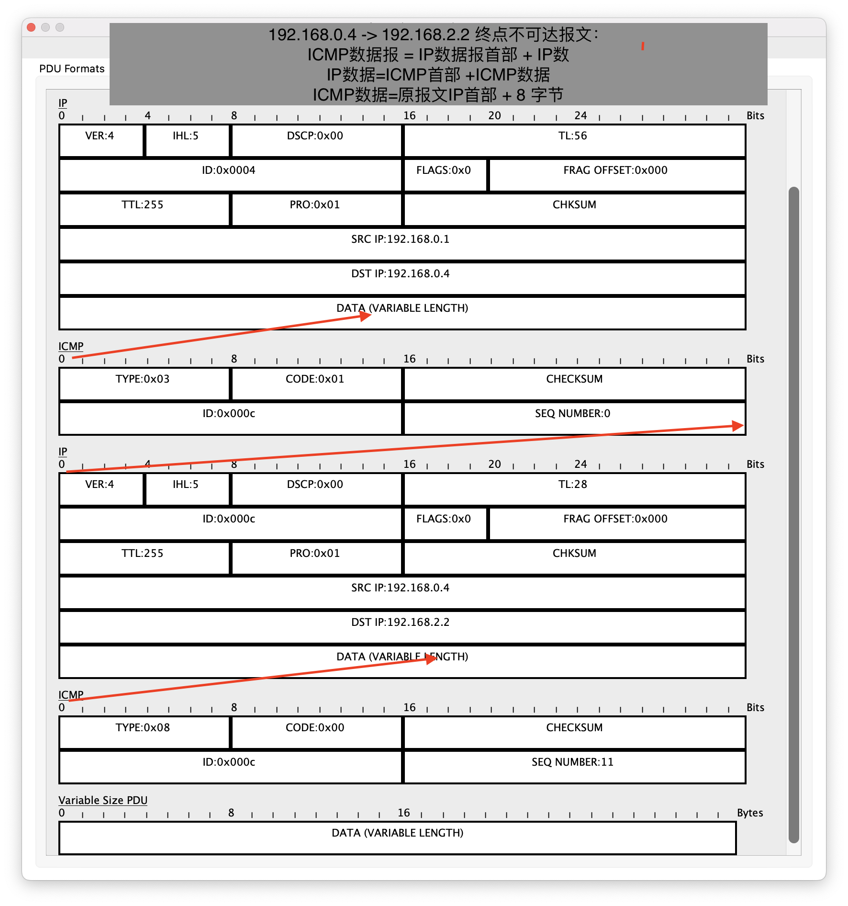

  - 时间超过：`0x0b`

    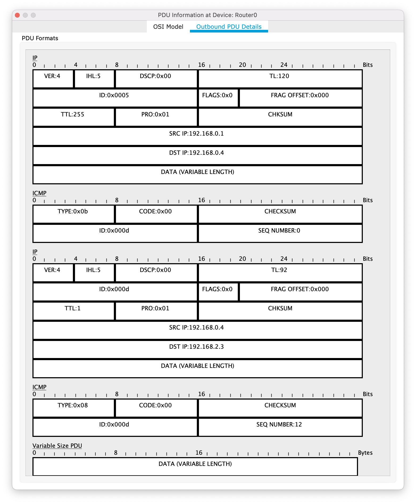

  - 参数问题: `0x0c`
  - 改变路由: `0x05`

- 询问与回复:

  - `Echo Request - Echo Reply`: `0x08 - 0x00`
    
    

    	
      
    

    
  - 时间戳请求与回答： `0x0d` - `0x0e`

- 应用：`PING(Packet InterNet Groper)`, `traceroute`

## 路由选择协议

- 自适应性
  - 静态路由选择
  - 动态路由选择

- 分层次

  自治系统（`AS, Autonomous System`）：单一技术管理下的一组路由器，使用相同的度量和路由选择协议。互联网由多个自治系统连接在一起。

  `inter vs intra` `interior vs external`

  - 内部网关协议（`IGP, Interior Gateway Protocol`）：AS内使用的协议。

  - 外部网关协议（`EGP, Enternal Gateway Protocol`）：AS间使用的协议。

### 内部网关协议

#### - 路由信息协议（`RIP, Routing Information Protocol`）

- 定义：

	- 分布式的基于距离向量的路由选择协议
	- 距离 = 跳数
	- 只适用小型互联网
	
- 特点：

  - 相邻路由器按固定间隔交换路由信息，超时未收到则把自身路由中相应表项跳数设为不可达。

- 格式：

  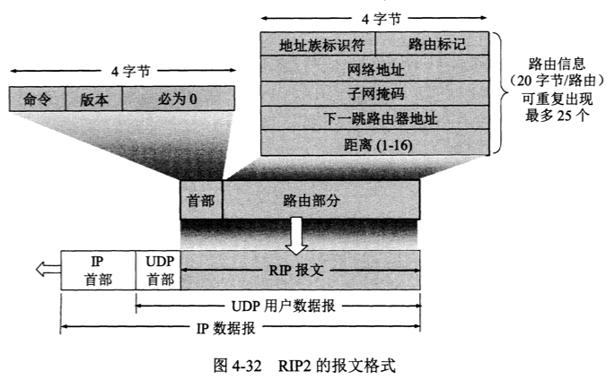

  - 命令：

    请求：0x01

    回答：0x02

  - 地址族标识符：0x02 IP地址

  - 路由标记：自治系统号，Autonomous System Number, 由IANA分配

    

- 优点：实现简单

- 缺点：

  - 只适用小网络，跳数<16
  - 坏消息传播得慢

#### - 开放最短路径优先（`OSPF, Open Shortest Path First`）

- 分布式的链路状态协议（`link state protocol`）

- 向自治系统内所有路由器发送消息-flooding

- 发送的信息是：与本路由器相邻的所有路由器的链路状态

- 链路状态改变时才发送

- 分层次

- 分区域

  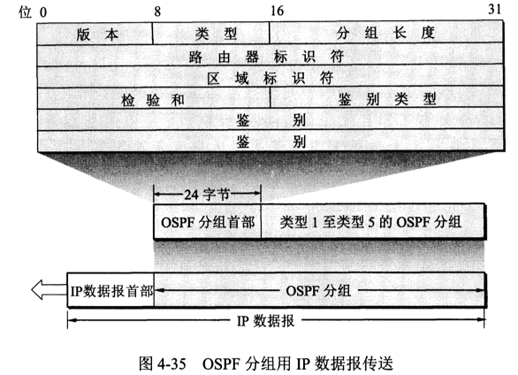

### 外部网关协议

- 边界网关协议（`BGP, Border Gateway Protocol`）

  - 特点：

  	- 自治系统之间交换路径信息
  	- 基于路径向量的路由选择协议
  	- 可达性 > 最佳

  	- 边界路由器

  	- 通过tcp连接建立BGP会话来交换路由信息

    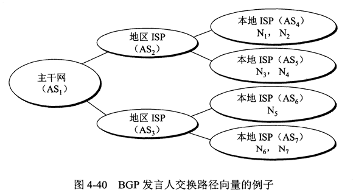
  
  - 路由表信息：
  
    网络前缀 + 下一挑路由器地址 + 自治系统路径
  
  - 格式：
  
    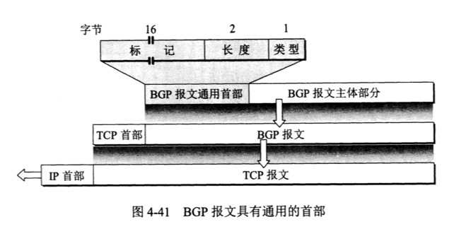

## 路由器

### 结构

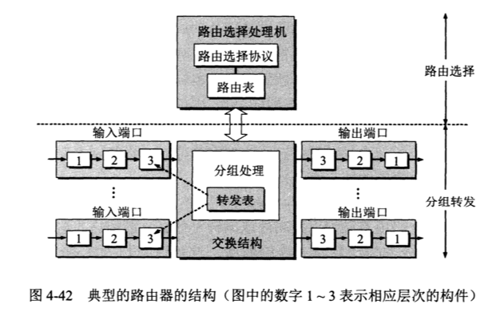

- ​                                         转发表                        vs.                 路由表

  目的网络地址 ----->   输出端口，MAC地址                     下一跳IP地址

  转发表由路由表得来

  转发表存在输入端口中

## IPv6

- 特点：

  - 更大的地址空间：32bit ----> 128bit
  - 灵活的首部格式
  - 自动配置，不需DHCP
  - 支持资源的预分配：流标号
  - 8字节对齐

- 结构：

  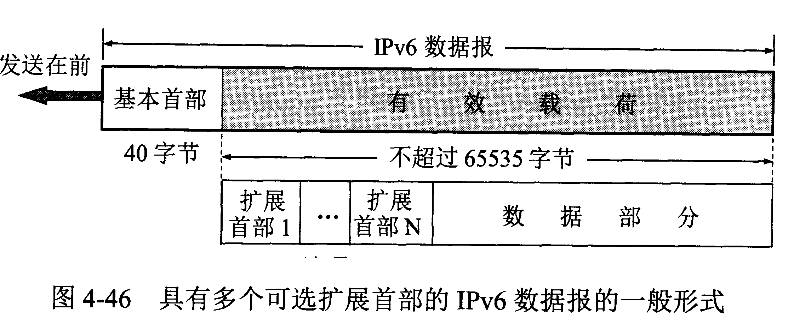

  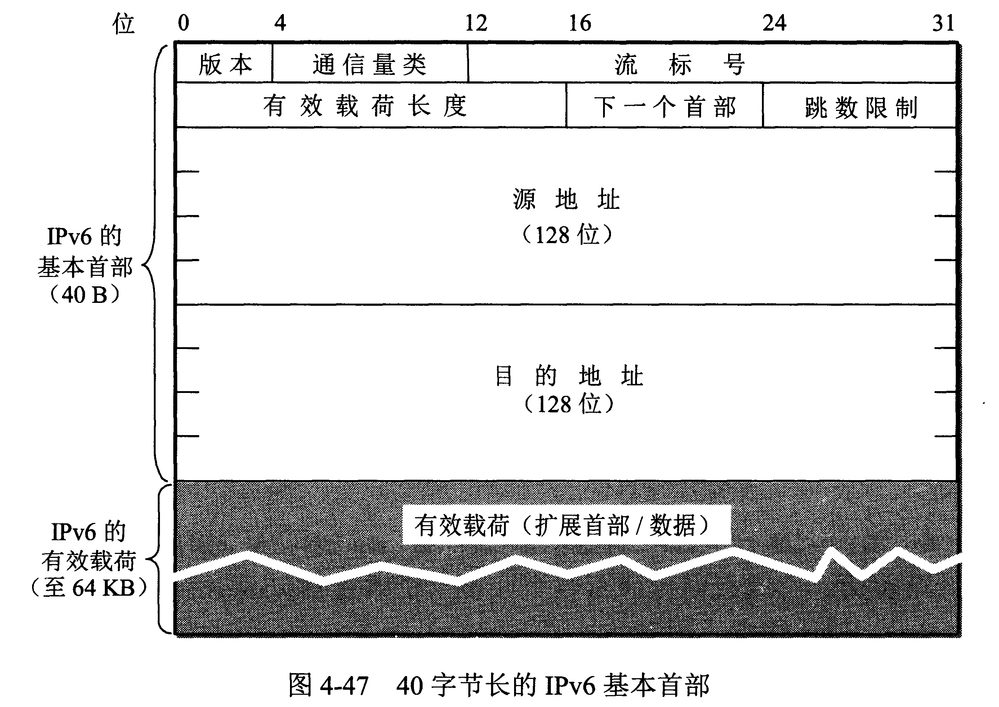
  - 版本：6
  - 通信量类（traffic class）：区分不同IPv6数据报的类别或优先级
  - 流标号（flow label）：流是指互联网络上从特定源点到特定终点的一系列数据报（如实时音视频传输），属于同一个流的数据报具有同样的标号。
  - 有效载荷长度（payload length）:除首部以外字节数
  - 下一个首部类型（next header type）：
    - 无扩展首部：数据部分对应的协议字段
    - 有扩展首部：下一个扩展首部类型。
      - 0x01-逐跳选项
      - 0x02-路由选择
      - 0x03-分片
      - 0x04-鉴别
      - 0x05-封装安全有效载荷
      - 0x06-目的站选项
  - 跳数限制
  - 源地址
  - 目的地址

- 地址：

  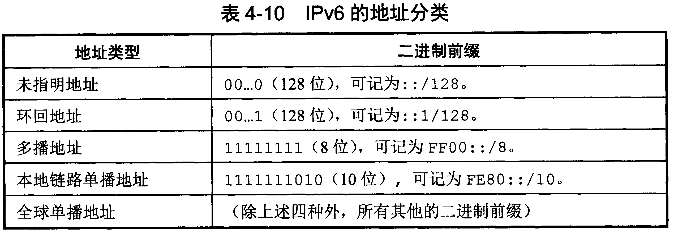

- 从IPv4向IPv6过渡：

  双协议栈 + 隧道技术

  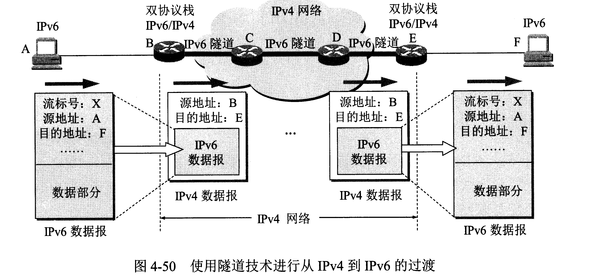

