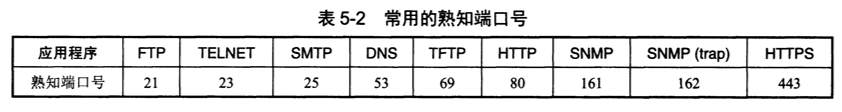

# 服务

- 网络层为主机之间提供逻辑通信服务，而运输层为应用进程之间提供端到端的逻辑通信

# 端口

- 主机不同应用进程的标识符，屏蔽操作系统的异质性
- 是应用层的各种协议进程与运输实体进行层间交互的一种地址
- 16bit
- 服务器使用的端口号：
  - 0 - 1023：系统端口号
  - 1024 - 49151: 登记端口号
- 客户端使用的端口号：
  - 49152 - 65535: 短暂端口号

# 用户数据报协议(`User Datagram Protocol, UDP`)

## 1. 特性-时延小

- 无连接，减少了建立连接的开销和发送数据之前的时延
- 尽最大努力交付，不保证可靠交付，可能丢失或失序
- 无拥塞控制，网络发生拥塞时可能丢失数据
- 面向应用层报文，不合并，不拆分，应用程序需自行选择合适大小的报文
- 支持一对一、一对多、多对一和多对多的交互通信
- 首部只有8个字节，开销小
## 2. 首部格式

- 源端口，需要对方回信是选用，不需要时可用全0
- 目的端口
- 长度，包括首部
- 检验和
# 传输控制协议(Transmission Control Protocol, TCP)

## 1. 特性

- 面向连接，有连接的管理（连接的建立和释放等）
- 可靠交付。无差错，不丢失，无重复，按序到达
- 面向字节流
- 点对点，一对一
- 全双工，TCP连接的两端都设有发送缓存和接收缓存

## 2. 套接字

每一条TCP连接唯一地被通信两端的两个端点所确定，这个端点即套接字

- 套接字：端口号`concatenated with` IP地址

## 3.可靠传输

- 理想条件下的传输即为可靠传输：
  - 传输信道不产生差错
  - 不管发送方以多快的速度发送数据，接收方总是来得及处理收到的数据

- 停止等待和超时重传