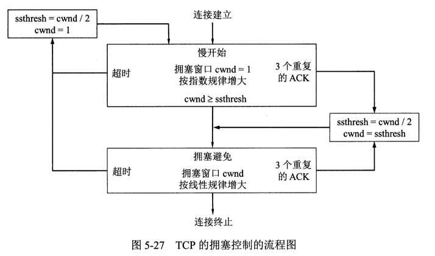

# 服务

- 网络层为主机之间提供逻辑通信服务，而运输层为应用进程之间提供端到端的逻辑通信

# 端口

- 主机不同应用进程的标识符，屏蔽操作系统的异质性
- 是应用层的各种协议进程与运输实体进行层间交互的一种地址
- 16bit
- 服务器使用的端口号：
  - 0 - 1023：系统端口号
  - 1024 - 49151: 登记端口号
- 客户端使用的端口号：
  - 49152 - 65535: 短暂端口号

# 用户数据报协议(`User Datagram Protocol, UDP`)

## 1. 特性-时延小

- 无连接，减少了建立连接的开销和发送数据之前的时延
- 尽最大努力交付，不保证可靠交付，可能丢失或失序
- 无拥塞控制，网络发生拥塞时可能丢失数据
- 面向应用层报文，不合并，不拆分，应用程序需自行选择合适大小的报文
- 支持一对一、一对多、多对一和多对多的交互通信
- 首部只有8个字节，开销小
## 2. 首部格式

- 源端口，需要对方回信是选用，不需要时可用全0
- 目的端口
- 长度，包括首部
- 检验和
# 传输控制协议(Transmission Control Protocol, TCP)

## 1. 特性

- 面向连接，有连接的管理（连接的建立和释放等）
- 可靠交付。无差错，不丢失，无重复，按序到达
- 面向字节流
- 点对点，一对一
- 全双工，TCP连接的两端都设有发送缓存和接收缓存

## 2. 套接字

每一条TCP连接唯一地被通信两端的两个端点所确定，这个端点即套接字

- 套接字：端口号`concatenated with` IP地址

## 3. 可靠传输的一般概念

- 理想条件下的传输即为可靠传输：
  - 传输信道不产生差错
  - 不管发送方以多快的速度发送数据，接收方总是来得及处理收到的数据
- 停止等待和超时重传

## 4. `TCP`首部格式

- ### 序号：

  本报文段所发送数据的第一个字节的编号。

- ### 确认号：

  确认号N表示到序号N - 1为止的所有数据都已正确收到。

- ### 数据偏移：

  报文段数据起始处相对于报文段起始处的偏移，即首部长度。

- ### `URG`和紧急指针: 

  用于发送紧急数据，即使窗口大小为0，也能发送。

  当URG=1时，紧急指针起作用，表示本报文段中首部后面跟着的紧急数据的字节数。

- ### `ACK`:

  `ACK = 1`表示确认号字段有效。

  TCP规定，在连接建立后所有传送的报文段都必须把`ACK`置1。

- ### `SYN`:

  在连接建立时用来同步序号。

  `SYN=1, ACK=0`: 连接请求报文段

  `SYN=1, ACK=1`: 连接接受报文段

- ### `FIN`:

  用来释放一个连接，`FIN=1`表示发送方的数据已发送完毕，并要求释放运输连接。

- ### `PSH`:

  接收方尽快向上交付，不用等待接受缓存条件。

- ### `RST`:

  拒绝建立一个连接或重新建立连接

- ### 窗口：

  发送方接受窗口大小，告知接收方从本报文段的确认号算起，目前允许对方发送的数据量。

- ### 检验和：

  包括首部和数据

- ### 选项：

  最长40字节

  - #### 最大报文段长度(`MSS, Maximum Segment Size`): 

    默认536字节

  - #### 窗口扩大选项

    3字节大小

  - #### 时间戳选项
## 5.`TCP`可靠传输的实现

- ### 以字节为单位的滑动窗口

  

  - #### 发送窗口：

    - 发送方允许发送的序号

    - 后沿后面的是已发送且已收到确认的字节

    - 前沿前面的是不允许发送的字节
    - 根据接收方的接收窗口动态调整发送方发送窗口大小

  - #### 接收窗口：

    - 接收方能够接收的序号
    - 后沿后面的是已发送确认，并保存在接收缓存中的数据
    - 前沿前面的不允许接收
    - 接收到数据，接收缓存减小，接收窗口减小；应用程序读取缓存，接收缓存变大，接收窗口变大
    - 接收窗口为0时，依然能接收零窗口探测、确认以及携带紧急数据的报文段

  - #### 发送缓存：

    - 发送方应用程序传送给发送方TCP准备发送的数据
    - TCP已发送但还未收到确认的数据
    - 应用程序写入，缓存减小；收到确认，缓存增加

  - #### 接收缓存：

    - 未按序到达的数据
    - 按序到达、已发送确认但未被应用程序读取的数据

- ### 超时重传时间的选择(`Retransmission Time-Out, RTO`)

  自适应算法：
  $$
  RTO = RTT_{s} + 4 * RTT_{D}
  $$
  其中$RTT_{s}$为加权平均往返时间，$RTT_{D}$是偏差的平均:
  $$
  RTT_{s} = (1 - \alpha) * (旧的RTT_{s}) + \alpha * (新的RTT_{s})
  $$

  $$
  RTT_{D} = (1 - \delta) * (旧的RTT_{D}) + \delta * |RTT_{s} - 新的RTT样本|
  $$

## 6.`TCP`的流量控制

- 滑动窗口机制，接收方控制发送方的发送速率
- 零窗口探测报文段

## 7.`TCP`的传输效率

本质是发送端报文段的发送时机以及接收端的确认时机的选择

- 发送时机的几种机制：

  - 发送缓存中的数据达到发送窗口的一半大小或达到MSS时
  - `PUSH`
  - 计时器

  `TCP`采用的时`Nagle`算法

- 确认时机：
  - 计时器
  - 接收缓存有一半的空隙空间或足够容纳一个MSS时
## 8.`TCP`的拥塞控制

- 发送方维持一个拥塞窗口`(congestion window, cwnd)`的变量

- ### 慢开始：

  - 初始拥塞窗口设置为2-4个`SMSS(Sender Maximum Segment Size)`
  - 每收到一个确认报文段，增加一个`SMSS`
  - 随传输轮次指数增长

- ### 拥塞避免：

  - 每经过一个传输轮次，增加一个`SMSS`
  - 加法增长

- ### 快重传：

  - 接收方每收到一个报文段，都要发出对已收到报文段的重复确认
  - 发送方一连收到3个重复确认，就立即重传

- ### 快恢复：

  出现超时时，不执行慢恢复，直接开始拥塞避免算法

  

